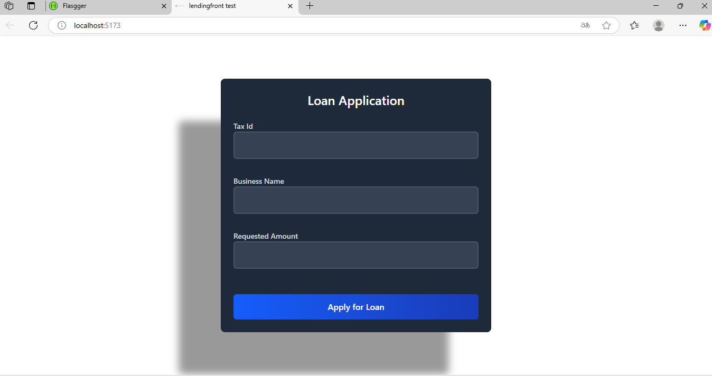

# Frontend LendingFront

This is the frontend application for the LendingFront platform. It allows users to submit loan applications and receive automated decisions based on the requested amount. The interface is designed with a dark theme and a smooth user experience in mind.

## Features

- Loan application form with real-time validation
- Dark-themed, responsive UI
- Interactive feedback using SweetAlert2
- Integration with backend API for loan decision logic

## Run End-to-End Tests (Playwright)
To run the functional end-to-end tests for the loan form:

1. Install Playwright

npm install -D @playwright/test
npx playwright install

2. Start the Application
npm run dev

3. Run the Tests
npx playwright test

4. View Results with UI (Optional)

npx playwright test --ui

## By

Carlos Andres Moreno Alvarez
